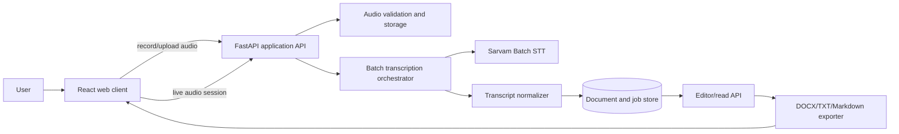
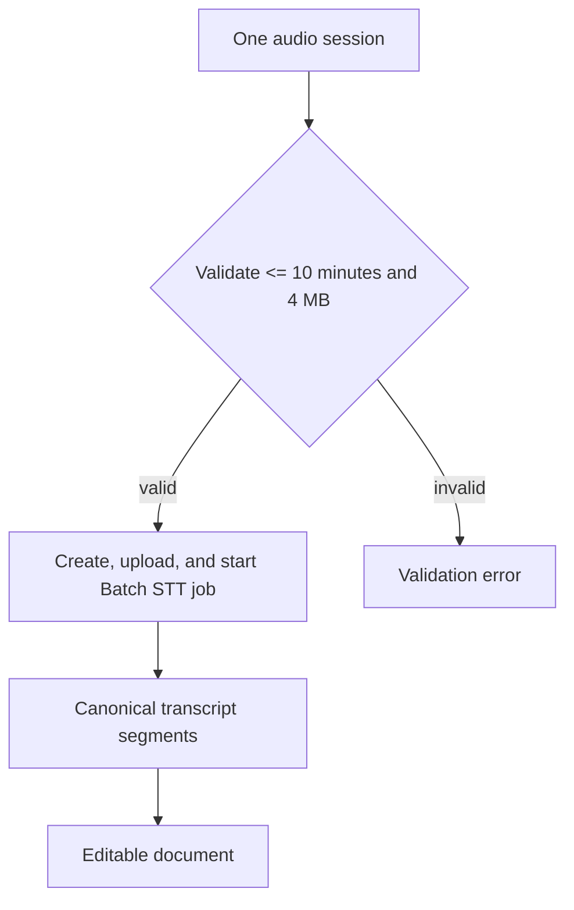

# Odia Speech-to-Text Document Generator

## 1. Product Goal

Build a local/development web application that accepts an Odia speech session of up to ten minutes and produces an editable, well-formatted document. The first release should support:

- Recording or uploading one audio session, limited to 10 minutes and 4 MB by the Vercel request-body constraint.
- Transcribing Odia with Sarvam Saaras.
- Showing the transcript with an editing experience.
- Preserving the raw transcript and Sarvam metadata.
- Exporting the edited content to a document format such as DOCX and plain text/Markdown.
- Retrying failed jobs without losing user work.

Deployment, cloud infrastructure, production domain setup, autoscaling, and operations are intentionally deferred.

## 2. Architecture Decision

Use a browser client plus a backend API. The Sarvam API key must remain on the backend and must never be sent to the browser.

Recommended initial stack:

| Layer | Recommendation | Reason |
|---|---|---|
| Web client | React + TypeScript | Recording, upload progress, editor, live status updates |
| Backend | Python + FastAPI | Natural fit for audio/file processing and Sarvam's official Python SDK |
| Sarvam integration | `sarvamai` SDK behind an adapter | Typed client, async support, retries, and mapped errors |
| Database | SQLite for development, repository abstraction | Projects, jobs, document versions, and resumability |
| File storage | Local filesystem behind a storage interface | Simple local development; replaceable later |
| Document export | Server-side DOCX generator plus Markdown/TXT | Keeps export deterministic and editable |
| Background execution | In-process development worker or task queue interface | Required because batch transcription is asynchronous |

The backend should own the workflow and expose application-level contracts. UI code should not depend directly on Sarvam request or response shapes.

## 3. Sarvam Capabilities Used

### Speech-to-text

- Primary model: `saaras:v3` initially, with `saaras:v4` behind configuration for evaluation. Sarvam documents v3 as the recommended default and v4 as the latest model.
- Batch API: primary integration; asynchronous; this app intentionally submits one file up to 10 minutes and 4 MB.
- REST endpoint: `/speech-to-text`, synchronous, maximum 30 seconds per request; optional future optimization only.
- Realtime WebSocket: `saaras:v3-realtime` or `saaras:v4`, optional future live mode, not part of the batch MVP.
- Modes: `transcribe`, `translate`, `verbatim`, `translit`, and `codemix`.
- Default application mode: `transcribe`, language `od-IN` for REST and batch.
- Response fields to retain: `request_id`, `transcript`, `language_code`, `language_probability`, timestamps, and diarized transcript when present.

### Text processing

Use Sarvam translation/text processing only as an optional later workflow, for example translating the completed Odia document into English. Do not put translation in the core transcription path.

### Document AI

Sarvam Document AI is for PDF/image/ZIP document digitisation or schema extraction. It is not needed to turn speech into a DOCX. It may be a later input path if the product must combine scanned Odia documents with spoken notes.

## 4. System Context



The orchestrator selects the Sarvam transport based on the audio workflow:



## 5. Core Backend Modules

```text
backend/
  app/
    main.py                 # FastAPI assembly
    api/
      routes_audio.py       # upload, record-session, validation
      routes_jobs.py        # status, retry, cancel if supported
      routes_documents.py   # read, update, versions
      routes_exports.py     # DOCX, Markdown, TXT
    domain/
      documents.py          # document entities and version rules
      transcription.py      # canonical transcript model
      jobs.py               # state machine
    services/
      transcription_orchestrator.py
      transcript_normalizer.py
      document_service.py
      export_service.py
    integrations/
      sarvam_client.py      # only place that knows SDK details
      sarvam_models.py
    infrastructure/
      db.py
      file_storage.py
      background_jobs.py
    config.py
```

### Sarvam adapter

Create a narrow interface such as:

```text
create_batch_job(audio_files, options) -> ExternalJobRef
get_batch_status(external_job_id) -> ExternalJobStatus
get_batch_results(external_job_id) -> list[SarvamTranscriptResult]
```

The adapter should centralize:

- `api-subscription-key` authentication through `SARVAM_API_KEY`.
- SDK initialization and model selection.
- The batch language code `od-IN` and model/mode configuration.
- Retry policy for 429, 500, and 503 only.
- Request IDs and external job IDs for diagnostics.
- Conversion of SDK exceptions into application errors.

## 6. Canonical Data Model

Do not store only one large transcript string. Store both the source response and a normalized segment list.

### Document

```text
Document
- id: UUID
- title: string
- language: "or"
- status: draft | processing | ready | failed
- active_version_id: UUID
- created_at: timestamp
- updated_at: timestamp
```

### Transcript segment

```text
TranscriptSegment
- id: UUID
- document_id: UUID
- ordinal: integer
- text: string
- speaker_id: string | null
- start_seconds: number | null
- end_seconds: number | null
- source: realtime_partial | realtime_final | rest | batch
- confidence: number | null
- is_edited: boolean
```

Sarvam currently provides chunk-level timestamps, not word-level timestamps. The model must therefore represent segment timing honestly and never present it as word timing.

### Transcription job

```text
TranscriptionJob
- id: UUID
- document_id: UUID
- transport: batch
- state: queued | uploading | submitted | running | completed | partial | failed | cancelled
- external_request_id: string | null
- external_job_id: string | null
- model: string
- mode: string
- requested_language: string
- detected_language: string | null
- language_probability: number | null
- error_code: string | null
- error_message: string | null
- created_at: timestamp
- updated_at: timestamp
```

Store the original Sarvam JSON response in a separate JSON/text field or sidecar file for auditability and future parser improvements. Never expose API keys in logs or stored payloads.

## 7. User Workflows

### A. Batch transcription for one session

1. User records or selects one supported audio file, up to 10 minutes and 4 MB.
2. Client sends it to `POST /api/documents` or a dedicated upload endpoint.
3. Backend validates MIME type, non-empty content, size, and duration.
4. Backend creates a Sarvam batch job with `model=saaras:v3`, `mode=transcribe`, and `language_code=od-IN`, uploads the file, and starts it.
5. Backend records the external job ID and returns the application job ID immediately.
6. A worker polls using a minimum 5-second interval, or processes a Sarvam webhook later when a public callback is available.
7. On completion, the worker downloads output JSON files, parses each result, and updates the document atomically.
8. Partial completion remains visible and retryable at file/segment level where possible.

Sarvam batch webhooks contain status notifications, not transcript text. The worker must still download the output files after receiving a completion notification. Browser recording is therefore saved as an audio file first; it is not sent as a realtime stream in the MVP.

## 8. API Contract Owned by Our Application

Suggested endpoints:

```text
POST   /api/documents
POST   /api/documents/{id}/audio
POST   /api/documents/{id}/transcriptions
GET    /api/transcription-jobs/{id}
POST   /api/transcription-jobs/{id}/retry
GET    /api/documents/{id}
PATCH  /api/documents/{id}/content
GET    /api/documents/{id}/versions
POST   /api/documents/{id}/exports
GET    /api/exports/{id}/download
```

The UI should receive stable application states such as `queued`, `processing`, `ready`, and `failed`, with a user-safe error message and a support/debug reference. Sarvam's raw status and error code should remain backend diagnostics.

## 9. Frontend Screens and Components

### Phase 1 screens

- New document: title, upload control, recording control, language/mode display.
- Processing state: progress, elapsed time, retry action, cancel/restart action.
- Editor: Odia-capable Unicode text editing, segment navigation, save status, undo/redo, title editing.
- Export menu: DOCX, Markdown, TXT.
- Error state: actionable validation/API message and job reference.

### Batch processing behavior

- Display upload progress separately from Sarvam processing progress.
- Show batch status, processed files, and available page/file-level diagnostics.
- Keep the editor read-only until the first successful transcript result is normalized.
- Preserve the uploaded audio and job state across browser refreshes.

## 10. Phased Delivery Plan

### Phase 0: API spike and decisions

Deliverables:

- Sarvam API key loaded only from environment configuration.
- One Odia audio fixture under 10 minutes and one invalid/over-limit fixture.
- Minimal SDK calls for batch create, upload, start, status, and download.
- Verified request/response fixtures for `saaras:v3` and an evaluation run with `saaras:v4`.
- Confirm batch job limits, output filenames, and the selected Saaras model with the provided API key.

Acceptance checks:

- An Odia batch job succeeds with `od-IN`.
- A session approaching 10 minutes and 4 MB is accepted, while an over-limit file is rejected before submission.
- Invalid key, unsupported file, 429, and 503 behavior is recorded.

### Phase 1: Foundation and batch MVP

Deliverables:

- FastAPI project, configuration, database migrations, and storage abstraction.
- Vanilla HTML/CSS/JavaScript shell with new-document and editor views.
- Sarvam adapter with batch job creation, upload, start, polling, and result download.
- File validation and canonical transcript normalization.
- SQLite document persistence, immutable versions, and Markdown/TXT export.

Acceptance checks:

- An Odia recording up to 10 minutes becomes an editable document after batch completion.
- Refreshing the page does not lose a completed document.
- Raw Sarvam response and request ID are retained.
- API key is absent from browser network payloads and logs.

### Phase 2: Reliable batch jobs

Deliverables:

- Batch job lifecycle and background worker.
- Polling at a safe interval, with configurable timeout.
- Job progress and terminal states.
- Chunk-level timestamps and optional diarization rendering.
- Retry handling for failed jobs, audit events, and idempotent result persistence.

Acceptance checks:

- A recording is submitted as one batch file and is never split merely because it is longer than 30 seconds.
- A batch webhook, when enabled later, triggers a result download rather than assuming transcript data is in the webhook.
- Partial batch completion is represented without discarding successful output.
- Duplicate completion events do not create duplicate document content.

### Phase 3: Optional live microphone mode

This phase remains outside the batch MVP. Browser recording is implemented as a complete-file upload; Sarvam realtime WebSocket streaming is intentionally deferred.

Deliverables:

- Browser audio capture and format conversion if required.
- Backend WebSocket bridge.
- Partial/final event reconciliation.
- Reconnect and local recovery behavior.
- Session duration and billing metadata display for diagnostics.

Acceptance checks:

- Partial events never remain duplicated after final events.
- Realtime uses valid mono 8 kHz or 16 kHz audio.
- Socket close/error codes become useful application states.
- Committed final text survives a socket interruption.

### Phase 4: Document-quality editing and export

Deliverables:

- Odia typography and Unicode-safe editing.
- Paragraph and heading tools, speaker labels, timestamps, and search.
- DOCX export with stable paragraph ordering and optional metadata.
- SQLite-backed version history and autosave.
- Import/export tests using representative Odia text.

Acceptance checks:

- Odia conjuncts and combining marks survive save, reload, and DOCX export.
- Edited text is distinct from the immutable raw transcript.
- Exported documents open in a standard office editor without corruption.

### Phase 5: Quality, safety, and pre-deployment readiness

Deliverables:

- Golden audio evaluation set covering accents, noise, code-mixing, names, numbers, and multiple speakers.
- Accuracy dashboard for word/character error review by sample, not only aggregate score.
- Structured logs, redacted error reporting, audit events, and usage counters.
- File size/duration quotas and cleanup policies.
- Security review of uploads, downloads, path handling, and stored audio. The current implementation applies MIME/size/duration validation, redacts API keys from errors, deletes successful source audio, and retains failed source audio only for bounded retry/cleanup.
- Product decision on optional translation, transliteration, and Sarvam Vision input.

Implemented in the current development build: golden sample metadata, NFC-aware WER/CER utilities, structured logging, redacted errors, audit events, usage summaries, upload quotas, and age-based cleanup. Deployment remains outside this phase.

## 11. Reliability and Error Policy

- Retry only transient `429`, `500`, and `503` responses with exponential backoff and a cap.
- Do not retry `400`, `403`, or `422` without changing the request.
- Treat Sarvam authentication failures as `403`, not only `401`.
- Include Sarvam `request_id` or `job_id` in server logs and a non-sensitive support reference in the UI.
- Make job completion idempotent using the external job ID and output filename.
- Use bounded polling; do not poll faster than Sarvam's documented guidance.
- Validate audio before consuming API credits whenever duration and MIME metadata are available.
- Store temporary files outside the web root and serve exports through authorization checks.

## 12. Testing Strategy

- Unit tests for language-code mapping, job state transitions, retry classification, transcript normalization, and partial/final reconciliation.
- Adapter contract tests with mocked Sarvam SDK responses.
- API tests for upload, status, retry, editor save, and export.
- Browser tests for recording/upload, processing states, Unicode editing, refresh recovery, and export download.
- Fixture tests for REST responses, batch JSON output, diarization, timestamps, partial completion, and all important error shapes.
- Manual accuracy review using real Odia audio before changing model or normalization rules.

## 13. Decisions to Confirm Before Implementation

1. Should browser recording be saved locally and uploaded as one completed batch file, or should the first UI support file upload only?
2. Should the generated document remain Odia-only, or should English translation be an explicit second output?
3. Is speaker diarization needed for the target recordings?
4. Should users authenticate in the application, or is this initially a single-user local tool?
5. Which DOCX formatting is required: plain transcript, headings, timestamps, speaker labels, or a custom template?
6. What audio retention policy is acceptable during development?

## 14. Documentation Sources Reviewed

- Sarvam Speech-to-Text overview: https://docs.sarvam.ai/api/api-guides-tutorials/speech-to-text/overview
- Saaras model guide: https://docs.sarvam.ai/api/getting-started/models/saaras
- REST STT: https://docs.sarvam.ai/api/api-guides-tutorials/speech-to-text/rest-api
- Batch STT: https://docs.sarvam.ai/api/api-guides-tutorials/speech-to-text/batch-api
- Realtime STT: https://docs.sarvam.ai/api/api-guides-tutorials/speech-to-text/realtime-streaming
- Authentication: https://docs.sarvam.ai/api-reference/authentication
- SDKs: https://docs.sarvam.ai/api/getting-started/sdks
- Rate limits: https://docs.sarvam.ai/api/getting-started/ratelimits
- Errors and troubleshooting: https://docs.sarvam.ai/api/getting-started/errors-troubleshooting
- Document Intelligence: https://docs.sarvam.ai/api/api-guides-tutorials/document-intelligence/overview
